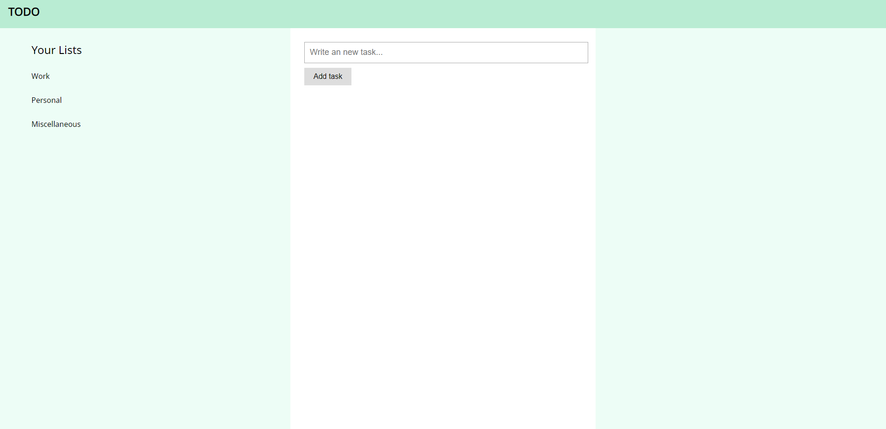
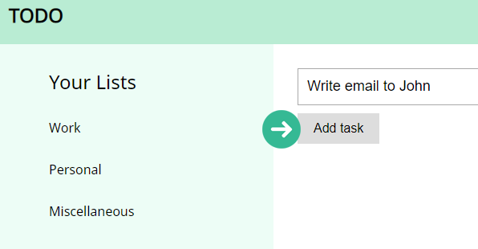
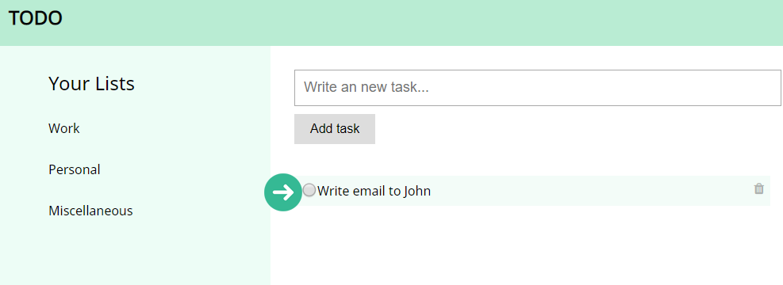
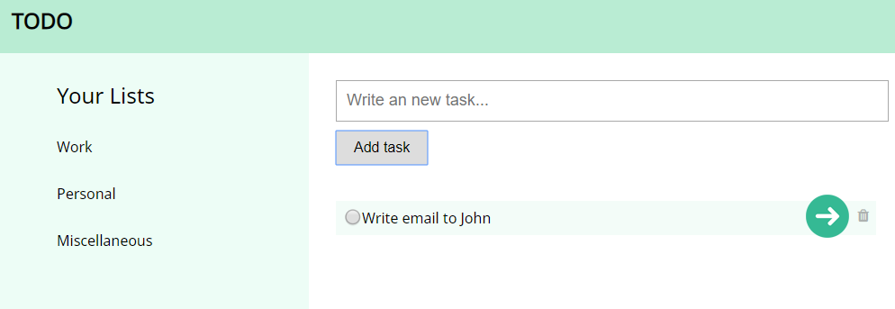

# To Do App


## Table of Contents

| | Title |
| -- | ----- |
| 1 | **[Project Details](#project-details)** |
| 2 | **[How to Contribute?](#how-to-participate-in-hacktoberfest-2019)** |
| 3 | **[Top Contributors](#top-contributors)**

## Project details

> 1. To Do App user interface



> 2. Add your tasks to the list



> 3. Check the task off if you have completed it



> 4. Delete the task from the list



## **How to participate in** _Hacktoberfest 2019?_

[Sign up here!](https://hacktoberfest.digitalocean.com/)

First of all, what is **Hacktoberfest**?

**Hacktoberfest®** is open to everyone in our global community. Whether you’re a developer, student learning to code, event host, or company of any size, you can help drive growth of **open source** and make positive **contributions** to an ever-growing community. All backgrounds and skill levels are encouraged to complete the challenge.

+ Hacktoberfest is open to everyone in our global community!
+ Pull requests can be made in any GitHub-hosted repositories/projects.
+ Sign up anytime between October 1 and October 31.

**Follow these steps:**

## 1. Fork this repository

**Fork** this repository by clicking on the fork button on the top of this page. This will create a copy of this repository in your GitHub account.

## 2. Clone the repository

Now, clone the forked repository to your machine.
Go to your GitHub account, open the forked repository, click on the **clone button** and then click the **copy to clipboard** icon.

Open your **terminal** and run the following git command:

```Git
git clone {url you just copied}
```

**_Note:_** Do not type the _curly brackets_ into the terminal

**For example:**

```Git
git clone https://github.com/your-github-username/Todo.git
```

## 3. Create a branch

Change the repository directory on your computer.

```Git
cd Todo
```

Now, create a branch using ```git checkout``` command:

```Git
git checkout -b {your-new-branch-name}
```

**For example:**

```Git
git checkout -b new-todo-feature
```

## 4. Make necessary changes and commit those changes

Let say you have made some changes for ```index.html```. Save the file and add it to the working directory.

```Git
git add index.html
```

Now, commit those changes using the ```git commit``` command:

```Git
git commit -m 'Add a new todo list name'
```

## 5. Push changes to GitHub

Push the changes using ```git push``` command:

```Git
git push origin {your-new-branch-name}
```

**replace** ```{your-new-branch-name}``` with the name of the branch you created earlier.

## 6. Submit your changes for review

Go to your repository on GitHub, you will see a ```Compare & pull request``` button. Click on that button.

You can write more details about your changes before you submit the pull request.

Finally, click on the ```Create pull request``` to submit your pull request (PR).

**_Note:_** If you wish to know more about how to make a pull request.

[Click here to learn more!](https://www.digitalocean.com/community/tutorials/how-to-create-a-pull-request-on-github)

## **Top Contributors**

1. [Lakshya Khera](https://github.com/lakshyabatman)

### :raised_hands: _Feel free to contribute to this project, fixing bugs or adding new features!_

### Happy Coding! :rocket: